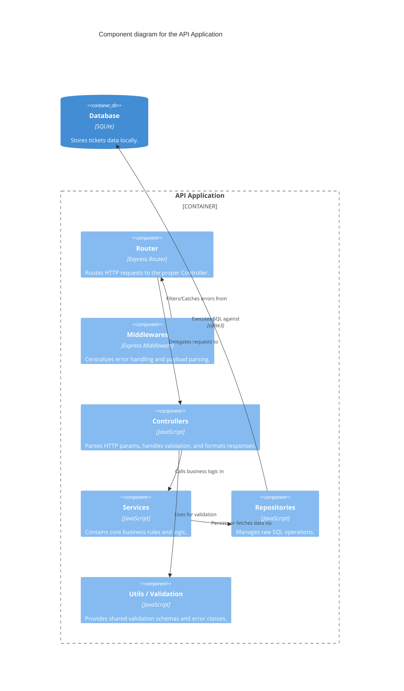

# C4 Component Diagram

## Diagram

## Explanation

The Component Diagram zooms deeply into the Node.js API application structure.
It highlights the strict Layered Architecture being followed:
- Incoming requests hit the **Router** (guarded by **Middlewares**).
- The Router calls a specific **Controller** action.
- The Controller validates user payload through **Utils** and invokes the **Service**.
- The Service runs business rules and uses the **Repository** pattern to decouple SQL query logic from business behaviors.
- The Repository finally speaks to the external **Database**.
