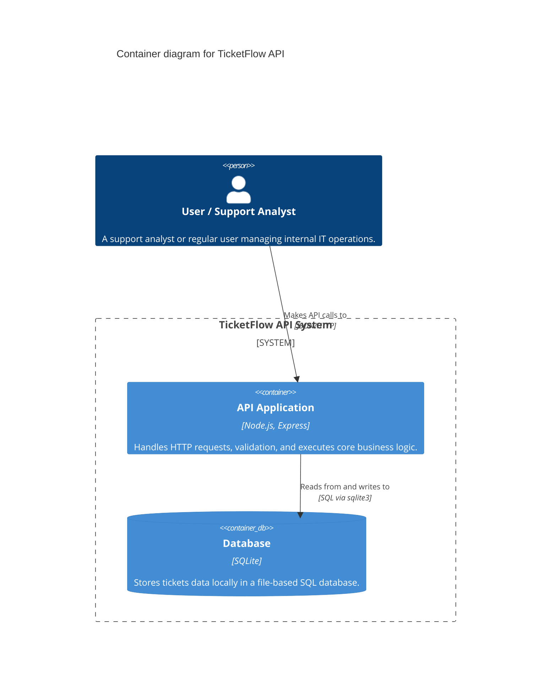

# C4 Model - Container Diagram (Level 2)

Este diagrama "abre" a caixa do sistema TicketFlow, demonstrando por quais containers independentes e grandes linguagens/sistemas operacionais (Web App, Back-end, Banco) ele é composto.

## Diagrama (Mermaid)

```mermaid
flowchart TB
    UserSuporte(Técnico de TI\n[Pessoa])

    subgraph TicketFlow [TicketFlow System]
        WebApp("Frontend SPA (Dashboard Web)\n[Container: React / Navegador]\n\nInterface gráfica rica para os funcionários interagirem sem precisar entender comandos técnicos.")
        API("TicketFlow Core API\n[Container: Node.js 18 / Express]\n\nRecebe requisições HTTP, valida os dados, orquestra e dispara as regras lógicas de negócios (Status/Prioridades).")
        DB("Local Data Storage\n[Container: File System / JSON]\n\nGuarda em disco o estado mutável completo de todos os chamados abertos através do tempo.")
    end

    UserSuporte -- "Navega nas telas e botões" --> WebApp
    UserSuporte -- "Faz chamadas programáticas/cURL (Opcional)" --> API
    WebApp -- "Consome endpoints e envia payload \n[HTTPS / REST / JSON]" --> API
    API -- "Lê/Grava via módulo nativo \n[fs.promises]" --> DB

    classDef person fill:#08427b,stroke:#052e56,color:#fff,rx:5px,ry:5px
    classDef containerApp fill:#438dd5,stroke:#2a5e93,color:#fff,rx:5px,ry:5px
    classDef containerDb fill:#2a5e93,stroke:#15375c,color:#fff,rx:5px,ry:5px,shape:cylinder

    class UserSuporte person
    class WebApp,API containerApp
    class DB containerDb
```

## Explicação Técnica (Visão Engenheiro)
Aqui a tecnologia emerge. Revelamos que o sistema web baseia-se num SPA e que o Back-end é o Node.js.
A fronteira delimitada `[TicketFlow System]` deixa transparente quais peças sofreriam deploy. Se migrássemos a aplicação para produção profissional (Roadmap), o container da API ditaria a necessidade de *Docker*, o DB viraria um *RDS do Postgres*, e o WebApp iria para *Cloudflare/S3*. Apenas a linha tracejada apontando para "JSON" precisaria ser alterada para "SQL/TCP".
# C4 Container Diagram

## Diagram



## Explanation

The Container Diagram breaks down the TicketFlow system into two main structural containers:
1. **API Application (Node.js/Express):** This is the executable process where all business logic, routing, and validations reside. It serves as the gateway for users.
2. **Database Container (SQLite):** This represents the active storage layer where ticket data is persisted, recently upgraded from a legacy JSON file to leverage relational SQL querying capabilities.

In the future, we could introduce new containers such as a Single Page Application (SPA Frontend) or integrate a third-party Container like Auth0 for authentication.
