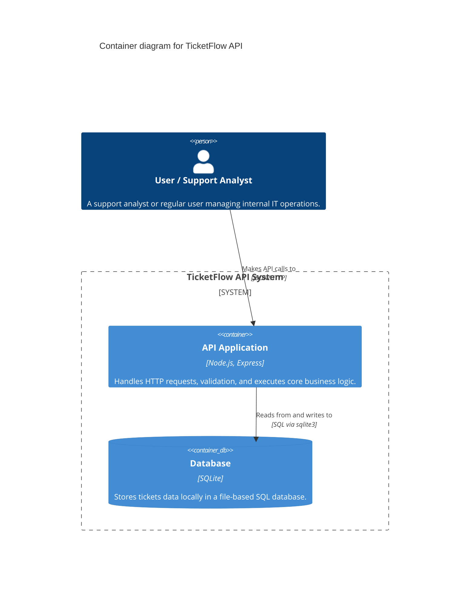

# C4 Container Diagram

## Diagram

## Explanation

The Container Diagram breaks down the TicketFlow system into two main structural containers:
1. **API Application (Node.js/Express):** This is the executable process where all business logic, routing, and validations reside. It serves as the gateway for users.
2. **Database Container (SQLite):** This represents the active storage layer where ticket data is persisted, recently upgraded from a legacy JSON file to leverage relational SQL querying capabilities.

In the future, we could introduce new containers such as a Single Page Application (SPA Frontend) or integrate a third-party Container like Auth0 for authentication.
