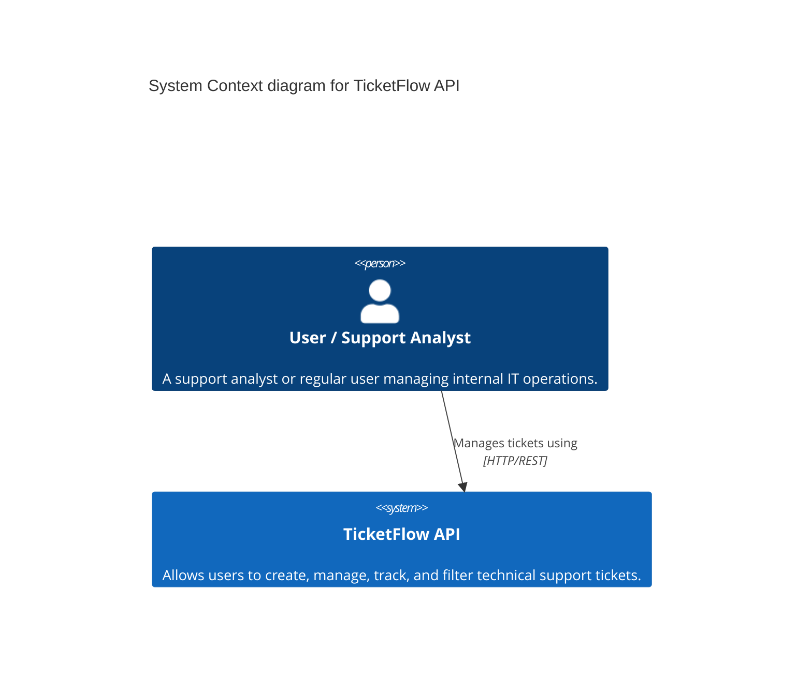

# C4 Context Diagram

## Diagram

## Explanation

The Context Diagram provides the big-picture view of the system.
In this case, the **User or Support Analyst** interacts directly with the **TicketFlow API** through HTTP REST endpoints. Currently, the system operates standalone, maintaining its state independently without relying on external services (like a separate authentication provider or email service, which could be future enhancements).
