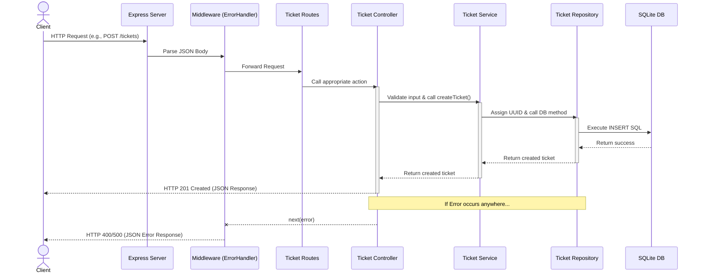

# Request Flow Diagram

## Diagram

## Explanation

The Request Flow Diagram is a sequence chart that illustrates exactly how a single HTTP Request (for example, creating a new ticket) travels down the application layers and comes back.
It emphasizes the strictly linear top-down flow of dependencies:
`Client -> Route -> Controller -> Service -> Repository -> Database`.
It also demonstrates how the centralized `ErrorHandler` middleware catches any bubbling errors triggered within the lower levels.
