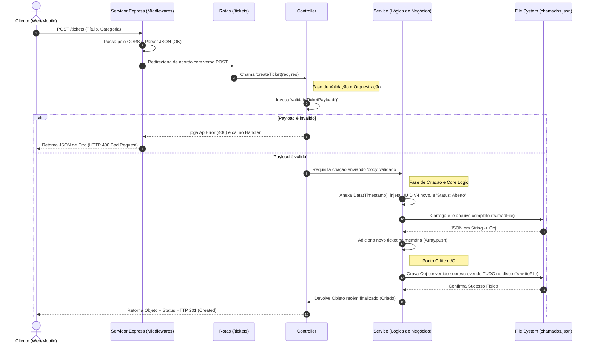

# Sequence Flow Diagram (Fluxo Completo de Requisição)

Diferente do Diagrama de Componentes que é estático (mostra o que as coisas são), este diagrama é temporal e focado na vida útil de uma requisição HTTP, exemplificando perfeitamente a **Criar Chamado**.

## Diagrama (Mermaid)

## Explicação Técnica (Visão Engenheiro)
O diagrama de sequência explicita o tempo de vida e os caminhos (Branches - Alternativas). Em um sistema moderno, este desenho ilustra exatamente a jornada síncrona Request/Response bloqueante base do REST. E evidencia um ponto de dor profundo para melhoria e debate técnico ("Ponto Crítico I/O"), que sinaliza que não importa o quão rápido a validação ocorra, o gargalo e lentidão estará ditado pela velocidade de leitura escrita total do arquivo de dados pelo Sistema Operacional físico da máquina.
# Request Flow Diagram

Diferente do Diagrama de Componentes que é estático (mostra o que as coisas são), este diagrama é temporal e focado na vida útil de uma requisição HTTP, exemplificando perfeitamente a **Criar Chamado**.

## Diagrama (Mermaid)

## Explicação Técnica (Visão Engenheiro)
O diagrama de sequência explicita o tempo de vida e os caminhos (Branches - Alternativas). Em um sistema moderno, este desenho ilustra exatamente a jornada síncrona Request/Response bloqueante base do REST. E evidencia um ponto de dor profundo para melhoria e debate técnico ("Ponto Crítico I/O"), que sinaliza que não importa o quão rápido a validação ocorra, o gargalo e lentidão estará ditado pela velocidade de leitura escrita total do arquivo de dados pelo Sistema Operacional físico da máquina.